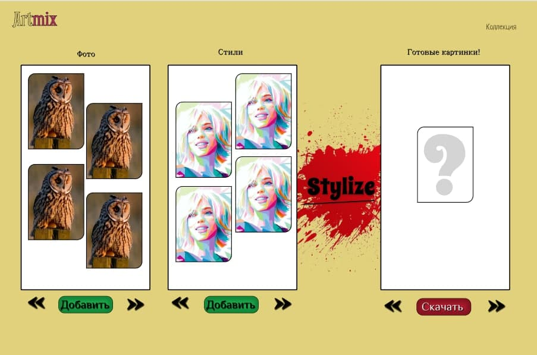

NIPS - Neural image processing service
---
Сервис по стилизации изображений.

Использует 2 изображения и на их основе с помощью 
нейронной сети, генерирует новое изображение. 

---

**Главная страница сайта**

Загружайте изображения либо в категорию `Фото` либо в категорию 
`Стили`, выберите одно изображение из фото и одно изображение из 
стилей, далее по кнопке `Stylize` начнется стилизация изображения. 

**Страница коллекции**

Тут можно посмотреть историю вашего изображения

---
Пример работы
---

**Фото**

**Фото стиля**

**Результат**

---
Описание приложения
---

Все запаковано в `Docker` контейнеры:
- `Vue.js` фронт сайта, через `API` загружает и запрашивает изображения. 
- `Nginx` сервер для запуска фронта на `Vue`
- `Django` серверная часть приложения, по сути от нее используется только 
`API` для работы с изображениями, я использую `Django DRF`
- `Celery` базируется на образе `Django` для асинхронной обработки 
изображений
- `Postgres` как БД для `Django`
- `Redis` для обмена результатом, для `Celery`

---

У контейнеров в хост машину открываем порты:

- Для сервера `Django` это `9100:8000`
- Для БД `Postgres` это `9101:5432`
- Для фронта `Vue` это  `9102:8000`

---

Через `docker-compose` прокинем порты и установим следующие связи между 
контейнерами:

---
Как запустить приложение
---

Запустить контейнеры

    docker-compose up

    # Или эта команда, что бы не блокировать терминал
    docker-compose up -d

После того как контейнеры будут запущены, можно зайти по этому адресу

    http://127.0.0.1:9102
